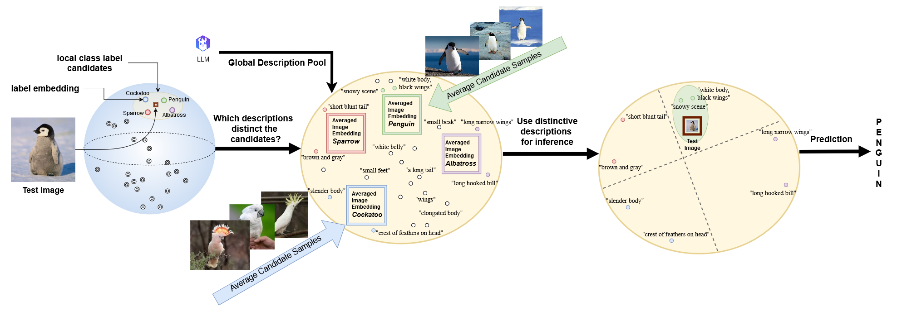

<p align="center">
 <h2 align="center"> 🦙 Does VLM Classification Benefit from LLM Description Semantics?</h2>
 <p align="center"> 
    Pingchuan Ma<sup>*</sup> · Lennart Rietdorf<sup>*</sup> · Dmytro Kotovenko · Vincent Tao Hu · Björn Ommer 
 </p><p align="center"> 
 </p>
 <p align="center"> 
    <b>CompVis Group @ LMU Munich, MCML</b>
 </p>
  <p align="center"> <sup>*</sup> <i>equal contribution</i> </p>
</p>

</p>
<p align="center">
    <a href=" ">
        
    </a>
</p>

## 📖 Overview
Describing images accurately through text is key to explainability. Vision-Language Models (VLMs) as CLIP align images and texts in a shared space. Descriptions generated by Large Language Models (LLMs) can  further improve their classification performance. However, it remains unclear if performance gains stem from true semantics or semantic-agnostic ensembling effects, as questioned by several prior works. To address this, we propose an alternative evaluation scenario to isolate the discriminative power of descriptions and introduce a training-free method for selecting discriminative descriptions. This method improves classification accuracy across datasets by leveraging CLIP’s local label neighborhood, offering insights into description-based classification and interpretability in VLMs. [Figure 1](#fig1) depicts this procedure.

This repository is our official implementation for the paper **"Does VLM Classification Benefit from LLM Description Semantics?"**. It enables the evaluation of Visual-Language Model (VLM) classification accuracy across different datasets, leveraging the semantics of descriptions generated by Large Language Models (LLMs). 

<a name="fig1"></a>
<div align="center">
  
  <p style="font-size: 1.2em; font-weight: bold;">Figure 1: Depiction of the suggested approach</p>
</div>

## 🛠️ Setup
### Environment
Results were obtained using `Ubuntu 22.04.5 LTS`, `Cuda 11.8`, and `Python 3.10.14` 

Install the necessary dependencies manually via
```bash
conda create -n <choose_name> python=3.10.14
pip install torch==2.2.1 torchvision==0.17.1 torchaudio==2.2.1 --index-url https://download.pytorch.org/whl/cu118
pip install tqdm
pip install torchmetrics
pip install imagenetv2_pytorch
pip install git+https://github.com/modestyachts/ImageNetV2_pytorch
pip install pyyaml
pip install git+https://github.com/openai/CLIP.git
pip install requests
```
The resulting python env will correspond to requirements.txt.
### Datasets

The datasets supported by this implementation are:
- **Flowers102**
- **DTD (Describable Textures Dataset)**
- **Places365**
- **EuroSAT**
- **Oxford Pets**
- **Food101**
- **CUB-200**
- **ImageNet**
- **ImageNet V2**

Most of these datasets will be automatically downloaded as `torchvision` datasets and stored in ```./datasets``` during the first run of ```main.py```. Instructions for datasets that have to be installed manually can be found below.

### CUB-200 Dataset
The CUB-200 dataset requires downloading the dataset files first, e.g. from https://data.caltech.edu/records/65de6-vp158 via
```bash
wget https://data.caltech.edu/records/65de6-vp158/files/CUB_200_2011.tgz?download=1D
```
After that, create a directory `./datasets/cub_200` where you unpack `CUB_200_2011.tgz`. The dataset is then ready for embedding.

### ImageNet Dataset
Follow the instructions to download ImageNet's dataset files under the following link:
```bash
https://pytorch.org/vision/main/generated/torchvision.datasets.ImageNet.html
```
Save these files to `./datasets/ilsvrc`. The dataset is then ready to use and embed for the ```main.py``` script.

### ImageNetV2 Dataset
ImageNetV2 is an additional test dataset for the ImageNet training dataset.
This dataset requires the installation of `imagenet_v2_pytorch` package stated above in the _Environment_.
The dataset files will be downloaded automatically.

## 🦙 Description Pools
Available description pools can be found under ```./descriptions```. DClip descriptions are taken from ```https://github.com/sachit-menon/classify_by_description_release```.
The description pools supported by this implementation are:
- **DClip**
- **Contrastive Llama**
  
Assignments of selected descriptions will be saved as JSON files to ```./saved_descriptions```.

## 🔢 Embeddings
In the first run of ```main.py```, the datasets will be embedded first by CLIP's VLM backbones before the description selection pipeline depicted in [Figure 1](#fig1) is executed. The image embeddings will be stored in ```./image_embeddings``` for further usage. This speeds up further executions of the script. 

## 🚀 Usage
### Run
To run the whole pipeline as depicted in [Figure 1](#fig1) call the script ```main.py```. As stated above, the new dataset will be downloaded and embedded in the first run of a new dataset. Use the following command with the following options:

```bash
python main.py --dataset <DATASET_NAME> --pool <DESCRIPTION_POOL> --encoding_device <CUDA_ID_0> --calculation_device <CUDA_ID_1>
```

### Arguments

`--dataset`
Choose the dataset to evaluate. Available options are:
  - **flowers**
  - **dtd**
  - **eurosat**
  - **places**
  - **food**
  - **pets**
  - **cub**
  - **ilsvrc**
  - **imagenet_v2**

_Be aware that_ Downloading and embedding the places dataset may take a long time. 

**Default:** `flowers`

`--pool`
Select the description pool to use for the evaluation. Available options are:
  - **dclip**
  - **con_llama**

**Default:** `dclip`

`--encoding_device` and `--calculation_device`
Select the cuda ID as an integer for encoding of images and texts; ID for evaluation device.

**Default:** 0 and 1


## 📈 Results
Our evaluation demonstrates that the proposed method significantly outperforms baselines in the classname-free setup, minimizing artificial gains from the ensembling effect. Additionally, we show that these improvements transfer to the conventional evaluation setup, achieving competitive results with substantially fewer descriptions required, while offering better interpretability.


## 🎓 Citation

If you use this codebase or otherwise found our work valuable, please cite our paper:

```bibtex
TBD
```

## 🔥 Updates and Backlogs
- [ ] add valid arXiv link and bibtex.
- [x] **[03.12.2024]** supported all datasets and tested with the env specified.
- [x] **[27.11.2024]** set up the repo.
